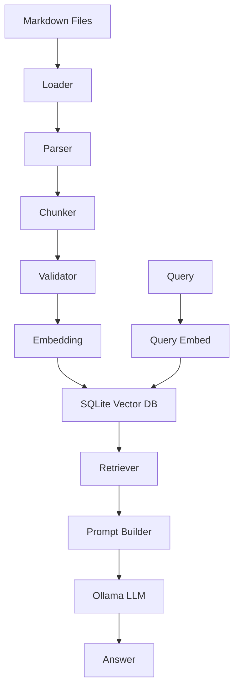
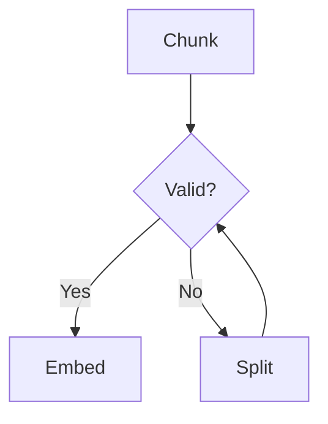
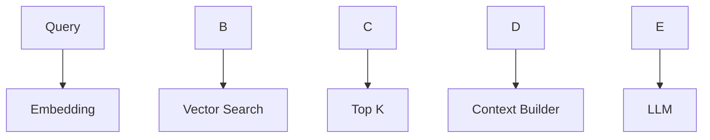
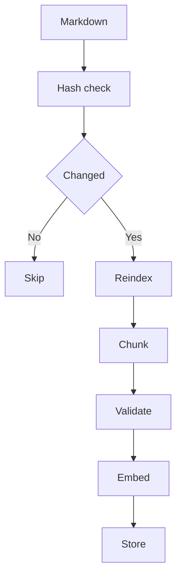

# RAG-PHP-SQLite - Software Requirements Specification (SRS)

---

## 1. General Provisions

### 1.1 System Purpose

The RAG-PHP-SQLite system is designed to build a local Retrieval-Augmented Generation (RAG) engine based on Markdown documents using PHP and SQLite.

The system provides:

* semantic search;
* storage of embedding vectors;
* answer generation via LLM (Ollama);
* complete autonomy without cloud services.

---

### 1.2 Scope of Application

* corporate knowledge bases
* technical documentation
* offline AI assistants
* local AI agents
* DevOps knowledge systems

---

### 1.3 Terms

| Term              | Description                                          |
| ----------------- | ---------------------------------------------------- |
| RAG               | Retrieval-Augmented Generation                       |
| Chunk             | Text fragment (usually 500-1500 tokens)              |
| Embedding         | Vector representation of text (vector dimension 768) |
| Retriever         | Search module                                        |
| LLM               | Large Language Model                                 |
| Cosine Similarity | Vector similarity metric (0-1)                       |
| Context Window    | Maximum LLM context size                             |

---

## 2. General Architecture



---

## 3. Architectural Principles

* modularity (SOLID)
* no hard-binding to a specific LLM
* ability to replace the embedding model
* incremental indexing
* fault tolerance
* local execution

---

## 4. Project Structure

```text
bin/
 ├── clear.php
 ├── index.php
 ├── query.php
 └── stats.php
src/
 ├── Loader/
 ├── Parser/
 ├── Chunker/
 ├── Validator/
 ├── Embedding/
 ├── Storage/
 ├── Retrieval/
 ├── Prompt/
 ├── Services/
 └── Utils/
```

---

## 5. Markdown Processing

### 5.1 Supported Constructs

* headers (#, ##, ###)
* lists
* tables
* code blocks
* quotes
* links

---

### 5.2 Parsing rules

* each header = new context
* is stored heading\_path
* is stored level nesting
* code blocks does not splits

---

### 5.3 Algorithm

```pseudo
for each document:
  parse markdown
  build tree
  flatten into sections
```

---

## 6. Chunking

### 6.1 Rules

* chunk = logical section
* max size = N tokens
* overlap optional

### 6.2 Split strategy

1. header split
2. paragraph split
3. sentence split
4. fallback char split

---

### 6.3 Pseudocode

```pseudo
if tokens(chunk) > limit:
    split by paragraphs
    if still large:
        split by sentences
```

---

## 7. Chunk Validator

### 7.1 Scope

The matching control to the embedding model restrictions.

### 7.2 Checkers

* token count
* size limit
* safety margin
* encoding validity

### 7.3 Behavior



---

## 8. Embedding system

### 8.1 Requirements

* changeable model
* retry logic
* timeout handling
* batch support

### 8.2 API (Ollama)

* /api/embeddings
* /api/embed

---

### 8.3 Retry strategy

* retry\_count = 3
* exponential backoff
* fallback log

---

## 9. SQLite storage

### 9.1 tables

#### documents

* id
* path
* hash
* created\_at

#### chunks

* id
* document\_id
* heading\_path
* text
* hash

#### embeddings

* chunk\_id
* vector

---

### 9.2 Vector search

Using:

* sqlite-vec OR
* cosine similarity fallback

---

### 9.3 Cosine similarity

```math
cos(A,B) = (A·B) / (|A||B|)
```

---

## 10. Retrieval

### 10.1 Retrieval pipeline



---

### 10.2 Ranking

* cosine similarity
* optional BM25 hybrid
* optional reranking

---

## 11. Prompt Builder

### 11.1 Prompt format

```text
SOURCE:
path > heading

TEXT:
...
```

### 11.2 Rules

* max context size
* dedup chunks
* ordering by score

---

## 12. Ollama integration

### 12.1 models

* embedding: qwen3-embedding:4b (or any other embedding model)
* generation: qwen3.5 (feel free to use your preferred model, I test with qwen3.5:2b)

### 12.2 endpoints

* /api/generate
* /api/embeddings

---

## 13. Indexing pipeline



---

## 14. Error handling

### 14.1 types

* embedding failure
* token overflow
* sqlite errors
* file corruption

### 14.2 strategy

* isolate document failure
* continue batch processing
* log errors

---

## 15. Performance

### 15.1 targets

* 100k chunks: < 2s retrieval
* indexing incremental only
* batch embeddings

### 15.2 optimizations

* caching embeddings
* precomputed hashes
* batch insert SQLite

---

## 16. Security

* local-only execution
* no external API required
* input sanitization
* markdown sanitization (future)

---

## 17. Configuration

```yaml
ollama:
  base_url: http://localhost:11434

embedding:
  model: qwen3-embedding:4b
  max_tokens: 2000
  safety_margin: 300
  retry: 3

llm:
  model: qwen3.5:2b
  temperature: 0.7

retrieval:
  top_k: 5
  threshold: 0.75
```

---

## 18. Testing

### 18.1 unit tests

* chunking correctness
* embedding validity
* retrieval accuracy

### 18.2 integration tests

* full pipeline
* Ollama interaction
* SQLite consistency

---

## 19. Metrics

* recall@k
* precision@k
* latency
* embedding failure rate

---

## 20. Future improvements

* BM25 + vector hybrid
* reranker model
* multi-vector embeddings
* graph-based retrieval
* REST API
* web UI

---

## 21. Acceptance criteria

System is valid if:

* indexes Markdown successfully
* retrieves relevant chunks
* generates answers via LLM
* handles errors gracefully
* supports incremental updates

---

## 22. Architectural improvements

### 22.1 Layered architecture

```text
Presentation
    ↓
Application
    ↓
Domain
    ↓
Infrastructure
```

### 22.2 Core interfaces

* EmbeddingProvider
* LLMProvider
* StorageInterface
* RetrieverInterface

All implementations should be injected via Dependency Injection.

### 22.3 Embedding versioning

Each embedding record shall store:

* embedding_model
* embedding_dimension
* embedding_version
* created_at

Changing the embedding model requires full re-indexing.

### 22.4 SQLite recommendations

Store all indexing operations inside a transaction.

Recommended indexes:

* INDEX(path)
* INDEX(hash)
* INDEX(document_id)
* sqlite-vec index (when available)

Embedding vectors shall be stored either through sqlite-vec or as BLOB/JSON according to the selected backend.

### 22.5 Context window protection

Before prompt generation, the system shall validate that the accumulated context fits within the configured LLM context window. If exceeded, the lowest-ranked chunks shall be removed until the limit is satisfied.

### 22.6 Retrieval metadata

Each chunk should contain:

* source\_path
* heading\_path
* token\_count
* language
* embedding\_model
* document\_hash
* chunk\_hash
