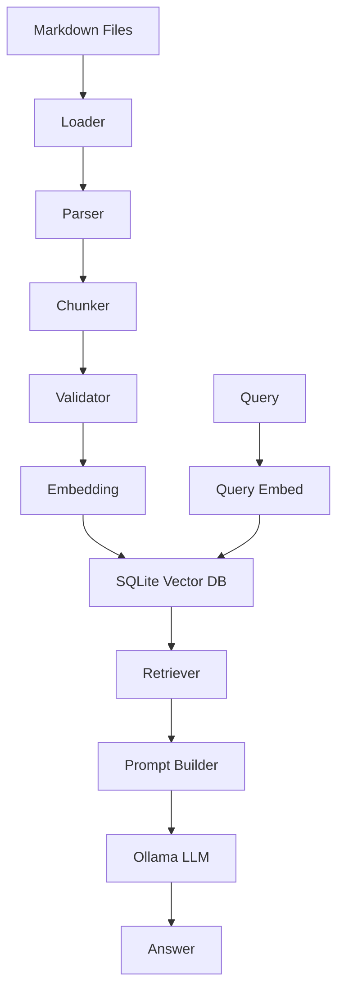
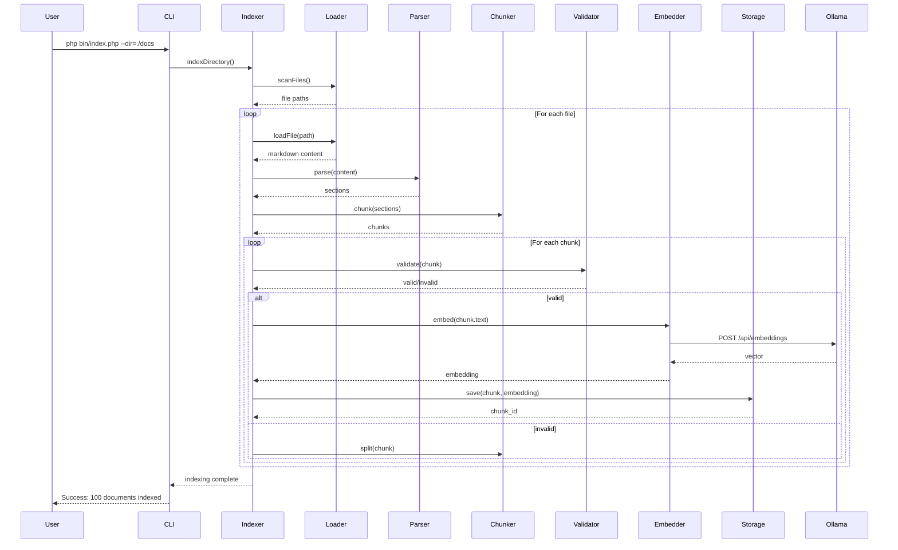
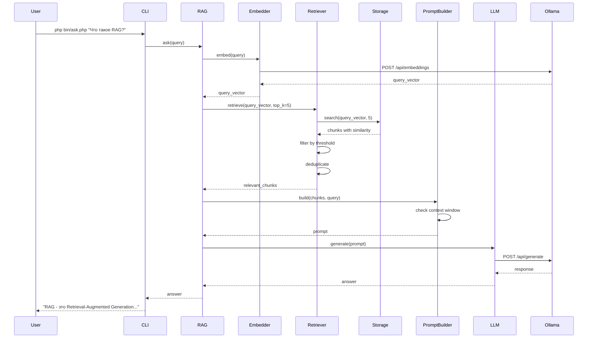
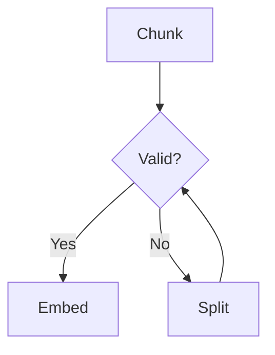
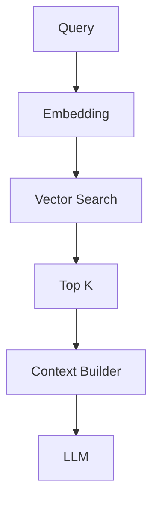
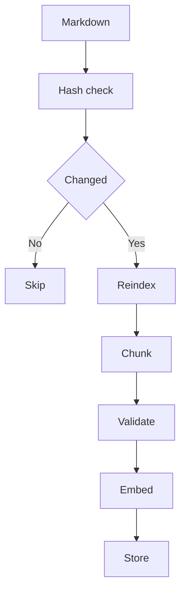

# RAG-PHP-SQLite
## Software Requirements Specification (SRS)

---

### 1. Общие положения

#### 1.1 Назначение системы

Система RAG-PHP-SQLite предназначена для построения локального Retrieval-Augmented Generation (RAG) движка на основе Markdown-документов с использованием PHP и SQLite.

Система обеспечивает:

* семантический поиск;
* хранение embedding-векторов;
* генерацию ответов через LLM (Ollama);
* полную автономность без облачных сервисов.

---

#### 1.2 Область применения

* корпоративные базы знаний
* техническая документация
* офлайн AI ассистенты
* локальные AI-агенты
* DevOps knowledge systems

---

#### 1.3 Термины

| Термин            | Описание                                                |
| ----------------- | ------------------------------------------------------- |
| RAG               | Retrieval-Augmented Generation                          |
| Chunk             | Фрагмент текста (обычно 500-1500 токенов)               |
| Embedding         | Векторное представление текста (вектор размерности 768) |
| Retriever         | Поисковый модуль                                        |
| LLM               | Large Language Model                                    |
| Cosine Similarity | Метрика схожести векторов (0-1)                         |
| Context Window    | Максимальный размер контекста LLM                       |

---

### 1.4 Use Cases

#### UC-1: Индексация документов

```bash
php bin/index.php --dir=./docs --recursive
```

Система сканирует все .md файлы, создает chunks, генерирует embeddings и сохраняет в SQLite.

#### UC-2: Поисковый запрос

```bash
php bin/query.php "Как настроить систему?"
```

Система находит релевантные chunks и выводит их с оценкой схожести.

#### UC-3: Генерация ответа с LLM

```bash
php bin/ask.php "Объясни архитектуру RAG"
```

Система находит контекст и генерирует ответ через Ollama.

#### UC-4: Обновление индекса

```bash
php bin/index.php --dir=./docs --incremental
```

Переиндексирует только измененные файлы (по hash).

---

### 2. Общая архитектура



---

### 2.1 Sequence Diagrams

#### Indexing Flow



#### Query Flow



---

### 3. Архитектурные принципы

* модульность (SOLID)
* отсутствие жесткой привязки к LLM
* возможность замены embedding модели
* инкрементальная индексация
* отказоустойчивость
* локальное выполнение

---

### 4. Структура проекта

```text
rag-php-sqlite/
├── bin/
│   ├── index.php       # CLI индексация
│   ├── query.php       # CLI поиск
│   └── ask.php         # CLI генерация ответов
├── src/
│   ├── Loader/
│   │   ├── MarkdownLoader.php
│   │   └── FileScanner.php
│   ├── Parser/
│   │   ├── MarkdownParser.php
│   │   └── HeadingTree.php
│   ├── Chunker/
│   │   ├── ChunkerInterface.php
│   │   ├── SemanticChunker.php
│   │   └── TokenCounter.php
│   ├── Validator/
│   │   ├── ChunkValidator.php
│   │   └── ValidationException.php
│   ├── Embedding/
│   │   ├── EmbeddingProvider.php (interface)
│   │   ├── OllamaEmbedding.php
│   │   └── EmbeddingCache.php
│   ├── Storage/
│   │   ├── StorageInterface.php
│   │   ├── SQLiteStorage.php
│   │   └── VectorSearch.php
│   ├── Retrieval/
│   │   ├── RetrieverInterface.php
│   │   ├── VectorRetriever.php
│   │   └── Ranker.php
│   ├── Prompt/
│   │   ├── PromptBuilder.php
│   │   └── ContextWindow.php
│   ├── LLM/
│   │   ├── LLMProvider.php (interface)
│   │   └── OllamaLLM.php
│   ├── Services/
│   │   ├── IndexingService.php
│   │   ├── QueryService.php
│   │   └── RAGService.php
│   └── Utils/
│       ├── Logger.php
│       └── Config.php
├── config/
│   └── config.yaml
├── data/
│   └── rag.sqlite
├── tests/
├── composer.json
└── README.md
```

---

### 4.1 Описание модулей

#### Loader

* **MarkdownLoader** — загружает .md файлы
* **FileScanner** — рекурсивное сканирование директорий

#### Parser

* **MarkdownParser** — парсит Markdown в структуру
* **HeadingTree** — строит дерево заголовков

#### Chunker

* **ChunkerInterface** — интерфейс для стратегий chunking
* **SemanticChunker** — разбивает по семантическим границам
* **TokenCounter** — подсчет токенов (tiktoken-подобный)

#### Validator

* **ChunkValidator** — проверяет размер chunks
* **ValidationException** — исключение при невалидных chunks

#### Embedding

* **EmbeddingProvider** — интерфейс для провайдеров
* **OllamaEmbedding** — реализация через Ollama API
* **EmbeddingCache** — кэш для embeddings

#### Storage

* **StorageInterface** — интерфейс хранилища
* **SQLiteStorage** — реализация на SQLite
* **VectorSearch** — поиск по векторам (cosine similarity)

#### Retrieval

* **RetrieverInterface** — интерфейс retriever
* **VectorRetriever** — векторный поиск
* **Ranker** — ранжирование результатов

#### Prompt

* **PromptBuilder** — строит промпт для LLM
* **ContextWindow** — контроль размера контекста

#### LLM

* **LLMProvider** — интерфейс LLM провайдера
* **OllamaLLM** — реализация через Ollama

---

### 5. Markdown обработка

#### 5.1 Поддерживаемые конструкции

* headers (#, ##, ###)
* lists
* tables
* code blocks
* quotes
* links

---

#### 5.2 Parsing rules

* каждый header = новый контекст
* сохраняется heading\_path
* сохраняется level вложенности
* code blocks не дробятся

---

#### 5.3 Алгоритм

```pseudo
for each document:
  parse markdown
  build tree
  flatten into sections
```

---

### 6. Chunking

#### 6.1 Правила

* chunk = логическая секция
* max size = 1500 tokens (настраивается)
* overlap = 200 tokens (опционально)
* min chunk size = 50 tokens

#### 6.2 Split strategy

1. header split
2. paragraph split
3. sentence split
4. fallback char split

---

#### 6.3 Псевдокод

```pseudo
if tokens(chunk) > limit:
    split by paragraphs
    if still large:
        split by sentences
```

---

### 7. Chunk Validator

#### 7.1 Назначение

Контроль соответствия ограничениям модели embedding.

#### 7.2 Проверки

* token count
* size limit
* safety margin
* encoding validity

#### 7.3 Поведение



---

### 8. Embedding system

#### 8.1 Требования

* сменяемая модель
* retry logic
* timeout handling
* batch support

#### 8.2 API (Ollama)

* /api/embeddings
* /api/embed

---

#### 8.3 Retry strategy

* retry_count = 3
* exponential backoff
* fallback log

---

### 9. SQLite storage

#### 9.1 Database Schema

```sql
CREATE TABLE documents (
    id INTEGER PRIMARY KEY AUTOINCREMENT,
    path TEXT NOT NULL UNIQUE,
    hash TEXT NOT NULL,
    size_bytes INTEGER,
    created_at DATETIME DEFAULT CURRENT_TIMESTAMP,
    updated_at DATETIME DEFAULT CURRENT_TIMESTAMP
);

CREATE INDEX idx_documents_path ON documents(path);
CREATE INDEX idx_documents_hash ON documents(hash);

CREATE TABLE chunks (
    id INTEGER PRIMARY KEY AUTOINCREMENT,
    document_id INTEGER NOT NULL,
    heading_path TEXT,
    level INTEGER,
    text TEXT NOT NULL,
    token_count INTEGER,
    hash TEXT NOT NULL,
    chunk_index INTEGER,
    created_at DATETIME DEFAULT CURRENT_TIMESTAMP,
    FOREIGN KEY (document_id) REFERENCES documents(id) ON DELETE CASCADE
);

CREATE INDEX idx_chunks_document ON chunks(document_id);
CREATE INDEX idx_chunks_hash ON chunks(hash);

CREATE TABLE embeddings (
    id INTEGER PRIMARY KEY AUTOINCREMENT,
    chunk_id INTEGER NOT NULL UNIQUE,
    vector BLOB NOT NULL,  -- JSON array или binary
    embedding_model TEXT NOT NULL,
    embedding_dimension INTEGER NOT NULL,
    embedding_version TEXT,
    created_at DATETIME DEFAULT CURRENT_TIMESTAMP,
    FOREIGN KEY (chunk_id) REFERENCES chunks(id) ON DELETE CASCADE
);

CREATE INDEX idx_embeddings_chunk ON embeddings(chunk_id);
CREATE INDEX idx_embeddings_model ON embeddings(embedding_model);

CREATE TABLE metadata (
    key TEXT PRIMARY KEY,
    value TEXT,
    updated_at DATETIME DEFAULT CURRENT_TIMESTAMP
);

-- Сохранение версии схемы и конфигурации
INSERT INTO metadata (key, value) VALUES ('schema_version', '1.0');
INSERT INTO metadata (key, value) VALUES ('embedding_model', 'nomic-embed-text');
```

---

#### 9.2 Vector search

Using:

* sqlite-vec OR, IF MISSING
* cosine similarity fallback

---

#### 9.3 Cosine similarity

```math
cos(A,B) = (A·B) / (|A||B|)
```

---

### 10. Retrieval

#### 10.1 Retrieval pipeline



#### 10.2 Ranking

**Основной метод:** Cosine Similarity

```php
function cosineSimilarity(array $a, array $b): float {
    $dotProduct = array_sum(array_map(fn($x, $y) => $x * $y, $a, $b));
    $magnitudeA = sqrt(array_sum(array_map(fn($x) => $x * $x, $a)));
    $magnitudeB = sqrt(array_sum(array_map(fn($x) => $x * $x, $b)));
    return $dotProduct / ($magnitudeA * $magnitudeB);
}
```

**Фильтрация результатов:**

* Threshold: similarity >= 0.75 (настраивается)
* Top-K: возвращать максимум K результатов
* Deduplication: удалять дубликаты по chunk hash

**Опциональные улучшения (v2.0):**

* BM25 hybrid ranking
* Reranking через cross-encoder
* MMR (Maximal Marginal Relevance) для diversity

#### 10.3 Формат результата

```php
class RetrievalResult {
    public int $chunkId;
    public string $text;
    public string $sourcePath;
    public string $headingPath;
    public float $similarity;
    public int $tokenCount;
}
```

---

### 11. Prompt Builder

#### 11.1 Prompt Template

```text
You are a helpful AI assistant. Answer the user's question based on the following context.

CONTEXT:
{context_chunks}

QUESTION:
{user_question}

INSTRUCTIONS:
- Use only the information from the context above
- If the context doesn't contain the answer, say "I don't have enough information"
- Be concise and precise
- Cite sources when relevant

ANSWER:
```

#### 11.2 Context Format

```text
SOURCE: docs/architecture.md > System Design > Components
SIMILARITY: 0.87
TEXT:
The system consists of three main components: Loader, Parser, and Chunker.
Each component is responsible for a specific task in the pipeline.
---

SOURCE: docs/setup.md > Installation
SIMILARITY: 0.82
TEXT:
To install the system, run: composer install
Then configure the config.yaml file with your Ollama endpoint.
---
```

#### 11.3 Rules

* **Max context size:** укладывается в context window LLM (по умолчанию 8192 tokens)
* **Dedup chunks:** удалять дубликаты по hash
* **Ordering:** сортировка по similarity score (desc)
* **Source attribution:** каждый chunk содержит source path и heading
* **Token budget:** резервировать 20% для ответа LLM

#### 11.4 Context Window Management

```php
function buildContext(array $chunks, int $maxTokens): string {
    $systemPrompt = loadSystemPrompt(); // ~200 tokens
    $userQuestion = $query; // ~50 tokens
    $reservedForAnswer = (int)($maxTokens * 0.2); // 20%
    
    $availableForContext = $maxTokens - 
        countTokens($systemPrompt) - 
        countTokens($userQuestion) - 
        $reservedForAnswer;
    
  /  $context = '';
    $tokenCount = 0;
    
    foreach ($chunks as $chunk) {
        if ($tokenCount + $chunk->tokenCount > $availableForContext) {
            break;
        }
        $context .= formatChunk($chunk);
        $tokenCount += $chunk->tokenCount;
    }
    
    return $systemPrompt . $context . $userQuestion;
}
```

---

### 12. Ollama integration

#### 12.1 models

* embedding: nomic-embed-text
* generation: qwen3.5

#### 12.2 endpoints

* /api/generate
* /api/embeddings

---

### 13. Indexing pipeline



---

### 14. Error handling

#### 14.1 Типы ошибок

* **EmbeddingException** — ошибка при получении embedding
* **TokenOverflowException** — превышение лимита токенов
* **StorageException** — ошибки SQLite
* **FileException** — ошибки чтения файлов
* **ValidationException** — невалидный chunk
* **ConfigException** — некорректная конфигурация
* **OllamaConnectionException** — недоступен Ollama API

#### 14.2 Стратегия обработки

* Изолировать ошибку документа — продолжить обработку других
* Логировать все ошибки с контекстом
* Retry для сетевых ошибок (embedding, LLM)
* Rollback транзакции при ошибке записи
* Graceful degradation — работа без векторного поиска при недоступности

#### 14.3 Журналирование

Для журналирования используется библиотека [Mc\Logger](https://github.com/mcroitor/logger.git). Можно расширить её под JSON журналирование (например, используя pretifier).

---

### 15. Performance

#### 15.1 Performance Targets

| Операция               | Целевое время | Объем данных     |
| ---------------------- | --------------| ---------------- |
| Индексация 1 документа | < 1s          | ~10KB            |
| Retrieval (top-5)      | < 2s          | 100K chunks      |
| Embedding generation   | < 500ms       | 1 chunk          |
| Full re-index          | < 5 min       | 1000 docs        |
| Incremental update     | < 30s         | 100 changed docs |

#### 15.2 Оптимизации

**Индексация:**

* Batch embedding requests (10 chunks/request)
* Предвычисление хешей для дедупликации
* Транзакции SQLite для пакетной записи
* Параллельная обработка файлов (если возможно)

**Поиск:**

* Кэширование embeddings для частых запросов
* Использование sqlite-vec (если доступно)
* Early stopping при достижении top-K
* Индексы на всех внешних ключах

**Память:**

* Streaming для больших файлов
* Освобождение памяти после обработки документа
* Ограничение размера batch

#### 15.3 Мониторинг

```php
// Метрики для логирования
- indexing_duration_seconds
- retrieval_duration_seconds
- embedding_duration_seconds
- chunks_processed_total
- errors_total
- cache_hit_ratio
```

---

### 16. Security

#### 16.1 Security Requirements

**Local-only execution:**

* Все данные обрабатываются локально
* Нет отправки данных в облачные сервисы
* Ollama работает на localhost

**Input Sanitization:**

```php
function sanitizeMarkdown(string $content): string {
    // Remove potentially dangerous constructs
    $content = strip_tags($content, ALLOWED_MARKDOWN_TAGS);
    $content = removeScriptBlocks($content);
    return $content;
}
```

**SQL Injection Prevention:**

* Использование prepared statements
* Параметризованные запросы
* Валидация всех входных данных

**Path Traversal Prevention:**

```php
function validatePath(string $path): bool {
    $realPath = realpath($path);
    $baseDir = realpath(BASE_DIR);
    return str_starts_with($realPath, $baseDir);
}
```

**Future Enhancements:**

* Markdown sanitization (удаление потенциально опасных конструкций)
* Rate limiting для API (если будет REST API)
* Access control (multi-user mode в v2.0)

---

### 16.2 Non-Functional Requirements (NFR)

#### Scalability

* **NFR-001:** Система должна поддерживать индексацию до 100,000 chunks без деградации производительности
* **NFR-002:** Размер БД не должен превышать 5 GB для 50,000 документов
* **NFR-003:** Время отклика retrieval должно масштабироваться логарифмически с ростом числа chunks

#### Reliability

* **NFR-004:** Система должна обрабатывать сбои embedding без полного краха индексации
* **NFR-005:** Транзакции БД должны откатываться при ошибках
* **NFR-006:** Uptime Ollama API: система должна корректно обрабатывать недоступность сервиса

#### Maintainability

* **NFR-007:** Код должен соответствовать PSR-12
* **NFR-008:** Покрытие unit-тестами ≥ 70%
* **NFR-009:** PHPStan level ≥ 6
* **NFR-010:** Все публичные API должны иметь PHPDoc комментарии

#### Usability

* **NFR-011:** CLI команды должны иметь --help
* **NFR-012:** Сообщения об ошибках должны быть информативными и содержать рекомендации
* **NFR-013:** Progress bar для длительных операций (индексация)

#### Portability

* **NFR-014:** Совместимость с PHP 8.1+ на Windows, Linux, macOS
* **NFR-015:** Минимальные системные зависимости (только PHP, SQLite)

#### Performance

* **NFR-016:** Индексация: < 1 сек на документ среднего размера (10KB)
* **NFR-017:** Retrieval: < 2 сек для 100K chunks
* **NFR-018:** Memory footprint: < 512 MB во время индексации

---

### 17. Configuration

#### 17.1 Файл конфигурации: config/config.yaml

```yaml
# Ollama settings
ollama:
  base_url: http://localhost:11434
  timeout: 60
  
embedding:
  model: nomic-embed-text
  dimension: 768
  max_tokens: 1500
  safety_margin: 300
  retry_count: 3
  retry_delay: 1000  # ms
  batch_size: 10
  
chunking:
  max_chunk_size: 1500  # tokens
  min_chunk_size: 50
  overlap: 200
  strategy: semantic  # semantic | fixed | paragraph
  
retrieval:
  top_k: 5
  similarity_threshold: 0.75
  rerank: false
  
llm:
  model: qwen3.5:2b
  temperature: 0.7
  max_tokens: 2000
  context_window: 8192
  
storage:
  database_path: ./data/rag.sqlite
  use_sqlite_vec: true  # если доступно расширение
  
logging:
  level: INFO  # DEBUG | INFO | WARNING | ERROR
  file: ./logs/rag.log
  console: true
  format: "[{timestamp}] {level}: {message}"
  
indexing:
  recursive: true
  file_extensions: ['.md', '.markdown']
  ignore_patterns: ['node_modules', '.git', 'vendor']
  incremental: true
```

#### 17.2 Переопределение через CLI

```bash
php bin/index.php --config=custom.yaml --embedding-model=mxbai-embed-large
```

#### 17.3 Валидация конфигурации

Система проверяет:

* существование модели в Ollama
* корректность путей
* валидность числовых параметров
* доступность базы данных

---

### 18. Testing

Использовать фреймворк [Mc\Unit](https://github.com/mcroitor/mc-unit).

#### 18.1 Unit Tests

**Chunking:**

```php
testChunkCreatesValidSizes()
testChunkRespectsBoundaries()
testChunkPreservesContext()
testChunkHandlesCodeBlocks()
testChunkHandlesTables()
```

**Embedding:**

```php
testEmbeddingReturnCorrectDimension()
testEmbeddingBatchProcessing()
testEmbeddingRetryLogic()
testEmbeddingCaching()
```

**Retrieval:**

```php
testRetrievalReturnsTopK()
testRetrievalFiltersbyThreshold()
testRetrievalDeduplicates()
testCosineSimilarityCalculation()
```

**Storage:**

```php
testDocumentSaveAndRetrieve()
testIncrementalIndexing()
testTransactionRollback()
testVectorSearch()
```

#### 18.2 Integration Tests

**Full Pipeline:**

```php
testEndToEndIndexingAndRetrieval()
testIncrementalUpdate()
testMultipleDocuments()
testErrorRecovery()
```

**Ollama Integration:**

```php
testOllamaEmbeddingGeneration()
testOllamaLLMGeneration()
testOllamaConnectionFailure()
testOllamaTimeout()
```

**SQLite Consistency:**

```php
testForeignKeyConstraints()
testIndexPerformance()
testConcurrentAccess()
testDatabaseMigration()
```

#### 18.3 Test Data

* Markdown документы разных размеров (1KB - 1MB)
* Различные Markdown конструкции
* Unicode и multilingual content
* Edge cases (пустые файлы, огромные таблицы, вложенные списки)

#### 18.4 Performance Tests

```php
testIndexing1000Documents()
testRetrieval100KChunks()
testEmbeddingBatch100Chunks()
testMemoryUsageDuringIndexing()
```

---

### 19. Metrics

#### 19.1 Quality Metrics

**Retrieval Quality:**

* **Recall@K** — доля релевантных документов в топ-K результатах
  * Target: Recall@5 ≥ 0.80
* **Precision@K** — доля релевантных среди возвращенных
  * Target: Precision@5 ≥ 0.70
* **Mean Reciprocal Rank (MRR)** — среднее обратное ранга первого релевантного результата
  * Target: MRR ≥ 0.75
* **NDCG@K** — нормализованный дисконтированный выигрыш
  * Target: NDCG@5 ≥ 0.75

**Answer Quality:**

* **Answer relevance** — релевантность ответа вопросу (LLM-оценка)
* **Context utilization** — использует ли ответ предоставленный контекст
* **Factual consistency** — соответствие ответа источникам

#### 19.2 Performance Metrics

**Latency:**

```text
indexing_duration_seconds{operation="full"}
indexing_duration_seconds{operation="incremental"}
retrieval_duration_seconds{top_k="5"}
embedding_duration_seconds{batch_size="10"}
llm_generation_duration_seconds
```

**Throughput:**

```text
documents_indexed_total
chunks_created_total
embeddings_generated_total
queries_processed_total
```

**Resource Usage:**

```text
memory_usage_bytes
database_size_bytes
cache_size_bytes
```

#### 19.3 Reliability Metrics

**Errors:**

```text
errors_total{type="embedding_failure"}
errors_total{type="token_overflow"}
errors_total{type="storage_error"}
errors_total{type="ollama_connection"}
```

**Success Rates:**

```text
embedding_success_rate = successful_embeddings / total_attempts
indexing_success_rate = successful_documents / total_documents
retrieval_success_rate = successful_queries / total_queries
```

**Retry Statistics:**

```text
retry_count{operation="embedding"}
retry_success_rate
```

#### 19.4 Cache Metrics

```text
cache_hit_ratio = cache_hits / (cache_hits + cache_misses)
cache_evictions_total
cache_size_items
```

**Target:** cache_hit_ratio ≥ 0.60 для частых запросов

#### 19.5 Data Quality Metrics

```text
average_chunk_size_tokens
chunk_size_distribution
duplicate_chunks_detected
invalid_chunks_rejected
```

#### 19.6 Logging Example

```json
{
  "timestamp": "2026-07-06T10:30:45Z",
  "level": "INFO",
  "event": "query_completed",
  "metrics": {
    "query": "Что такое RAG?",
    "retrieval_duration_ms": 1250,
    "chunks_retrieved": 5,
    "top_similarity": 0.89,
    "llm_generation_ms": 3400,
    "total_duration_ms": 4650,
    "cache_hit": false
  }
}
```

---

### 20. Installation Guide

#### 20.1 Требования

* PHP 8.1+
* Composer
* SQLite 3.35+
* Ollama (установлен и запущен)

#### 20.2 Установка

```bash
# 1. Клонировать репозиторий
git clone https://github.com/mcroitor/rag-php-sqlite.git
cd rag-php-sqlite

# 2. Установить зависимости
composer install

# 3. Создать директории
mkdir -p data logs

# 4. Скопировать конфигурацию
cp config/config.example.yaml config/config.yaml

# 5. Установить Ollama модели
ollama pull nomic-embed-text
ollama pull qwen3.5:2b

# 6. Инициализировать БД
php bin/setup.php
```

#### 20.3 Composer зависимости

```json
{
  "name": "mcroitor/RAG-PHP-SQLite",
  "description": "Local RAG engine using PHP, SQLite, and Ollama",
  "type": "project",
  "license": "MIT",
  "require": {
    "php": "^8.1",
    "ext-sqlite3": "*",
    "ext-json": "*",
    "mc/logger": "dev-master",
    "mc/http": "dev-master"
  },
  "require-dev": {
    "mc/unit": "dev-master"
  },
  "repositories": [
    {
      "type": "vcs",
      "url": "https://github.com/mcroitor/mc-logger.git"
    },
    {
      "type": "vcs",
      "url": "https://github.com/mcroitor/mc-http.git"
    },
    {
      "type": "vcs",
      "url": "https://github.com/mcroitor/mc-unit.git"
    }
  ],
  "autoload": {
    "psr-4": {
      "App\\": "src/"
    }
  },
  "minimum-stability": "dev",
  "prefer-stable": true
}
```

Библиотеки для использования:

* `\Mc\Logger` - для журналирования (https://github.com/mcroitor/mc-logger.git)
* `\Mc\Unit` - для тестов (https://github.com/mcroitor/mc-unit.git)
* `\Mc\Http` - для HTTP запросов (https://github.com/mcroitor/mc-http.git)

Предпочитать стандартную библиотеку и указанные библиотеки. Другие библиотеки не использовать.

#### 20.4 Проверка установки

```bash
# Проверить подключение к Ollama
php bin/check.php --ollama

# Проверить конфигурацию
php bin/check.php --config

# Тестовая индексация
php bin/index.php --dir=./examples
```

---

### 21. Out of Scope

Следующие функции **НЕ входят** в текущую версию:

* ❌ Веб-интерфейс (планируется v2.0)
* ❌ REST API (только CLI)
* ❌ Поддержка PDF, DOCX
* ❌ Мультимодальные embeddings (изображения)
* ❌ Distributed indexing
* ❌ Authentication/Authorization
* ❌ Real-time updates (только incremental re-indexing)
* ❌ Graph-based retrieval
* ❌ Multi-language support (только English/Russian)
* ❌ Cloud deployment (только локальный запуск)

---

### 22. Future improvements (v2.0)

* BM25 + vector hybrid search
* reranker model (cross-encoder)
* multi-vector embeddings
* graph-based retrieval (knowledge graph)
* REST API with OpenAPI spec
* web UI (React/Vue)
* streaming responses
* conversation history
* multi-user support

---

### 23. Acceptance Criteria

Система считается работоспособной, если:

#### Функциональные критерии

✅ **Индексация:**

* Успешно индексирует 1000+ Markdown файлов
* Обнаруживает изменения (incremental indexing)
* Обрабатывает сложный Markdown (tables, code blocks, nested lists)
* Создает валидные chunks (50-1500 токенов)

✅ **Поиск:**

* Находит релевантные chunks (recall@5 > 0.8)
* Возвращает top-K результатов за < 2 секунды
* Правильно ранжирует по cosine similarity

✅ **Генерация:**

* Генерирует корректные ответы через Ollama
* Использует найденный контекст
* Укладывается в context window LLM

✅ **Надежность:**

* Обрабатывает ошибки без краха системы
* Логирует все важные события
* Откатывает транзакции при ошибке

✅ **Производительность:**

* Индексация: < 1 сек на документ
* Retrieval: < 2 сек на запрос
* Embedding: < 500ms на chunk

#### Нефункциональные критерии

✅ **Масштабируемость:**

* Поддерживает до 100K chunks
* БД < 5 GB для 50K документов

✅ **Maintainability:**

* Код соответствует PSR-12
* Покрытие тестами > 70%
* PHPStan level 6+

✅ **Usability:**

* Понятный CLI интерфейс
* Информативные сообщения об ошибках
* Документация с примерами

---

### 22. Architectural improvements

#### 22.1 Layered architecture

```text
Presentation (CLI)
    ↓
Application (Services)
    ↓
Domain (Entities, Interfaces)
    ↓
Infrastructure (Storage, APIs)
```

#### 22.2 Core Interfaces

**EmbeddingProvider**

```php
interface EmbeddingProvider {
    public function embed(string $text): array;
    public function batchEmbed(array $texts): array;
    public function getDimension(): int;
    public function getModel(): string;
}
```

**LLMProvider**

```php
interface LLMProvider {
    public function generate(string $prompt, array $options = []): string;
    public function stream(string $prompt, callable $callback): void;
    public function getContextWindow(): int;
}
```

**StorageInterface**

```php
interface StorageInterface {
    public function saveDocument(Document $doc): int;
    public function saveChunk(Chunk $chunk): int;
    public function saveEmbedding(int $chunkId, array $vector): void;
    public function search(array $queryVector, int $topK): array;
    public function getDocumentByPath(string $path): ?Document;
}
```

**RetrieverInterface**

```php
interface RetrieverInterface {
    public function retrieve(string $query, int $topK = 5): array;
    public function retrieveByVector(array $vector, int $topK = 5): array;
}
```

**ChunkerInterface**

```php
interface ChunkerInterface {
    public function chunk(string $text, array $metadata = []): array;
    public function getMaxChunkSize(): int;
}
```

#### 22.3 Dependency Injection

```php
class RAGService {
    public function __construct(
        private EmbeddingProvider $embedder,
        private LLMProvider $llm,
        private StorageInterface $storage,
        private RetrieverInterface $retriever,
        private Logger $logger
    ) {}
}
```

Все зависимости должны внедряться через конструктор или DI-контейнер.

#### 22.4 Embedding versioning

Каждая запись embedding должна содержать:

* embedding_model (например, "nomic-embed-text")
* embedding_dimension (768)
* embedding_version ("v1.5")
* created_at

При изменении модели embedding требуется полная переиндексация.

**Проверка версии:**

```php
if ($storedModel !== $currentModel) {
    throw new EmbeddingVersionMismatchException(
        "Stored: $storedModel, Current: $currentModel. Re-indexing required."
    );
}
```

#### 22.5 SQLite рекомендации

**Транзакции:**

```sql
BEGIN TRANSACTION;
-- batch inserts
COMMIT;
```

**Индексы:**

```sql
CREATE INDEX idx_documents_path ON documents(path);
CREATE INDEX idx_documents_hash ON documents(hash);
CREATE INDEX idx_chunks_document ON chunks(document_id);
CREATE INDEX idx_embeddings_chunk ON embeddings(chunk_id);
```

**Vector storage:**

* С sqlite-vec: использовать нативную поддержку
* Без sqlite-vec: хранить как JSON или BLOB

#### 22.6 Context Window Protection

```php
function buildPrompt(array $chunks, int $maxTokens): string {
    $context = '';
    $totalTokens = 0;
    
    foreach ($chunks as $chunk) {
        if ($totalTokens + $chunk->tokenCount > $maxTokens) {
            break; // остановить, если превышен лимит
        }
        $context .= formatChunk($chunk);
        $totalTokens += $chunk->tokenCount;
    }
    
    return buildFinalPrompt($context);
}
```

Перед генерацией промпта система проверяет, что накопленный контекст помещается в context window LLM.

#### 22.7 Chunk Metadata

Каждый chunk должен содержать:

```php
class Chunk {
    public int $id;
    public int $documentId;
    public string $text;
    public string $sourcePath;
    public string $headingPath;
    public int $level;
    public int $tokenCount;
    public string $language;
    public string $hash;
    public int $chunkIndex;
    public DateTime $createdAt;
}
```

---

### 24. API Examples

#### 24.1 Programmatic Usage

```php
use RAG\Services\IndexingService;
use RAG\Services\RAGService;
use RAG\Embedding\OllamaEmbedding;
use RAG\LLM\OllamaLLM;
use RAG\Storage\SQLiteStorage;

// Инициализация
$config = Config::load('config/config.yaml');
$embedder = new OllamaEmbedding($config->ollama);
$llm = new OllamaLLM($config->ollama);
$storage = new SQLiteStorage($config->storage->database_path);

// Индексация
$indexer = new IndexingService($embedder, $storage);
$indexer->indexDirectory('./docs', recursive: true);

// Поиск и генерация ответа
$rag = new RAGService($embedder, $llm, $storage);
$answer = $rag->ask('Как настроить систему?');

echo $answer;
```

#### 24.2 CLI Commands

**Индексация:**

```bash
# Полная индексация
php bin/index.php --dir=./docs --recursive

# Инкрементальная
php bin/index.php --dir=./docs --incremental

# С пользовательской конфигурацией
php bin/index.php --dir=./docs --config=custom.yaml
```

**Поиск:**

```bash
# Только поиск chunks
php bin/query.php "Что такое RAG?" --top-k=5

# С порогом similarity
php bin/query.php "Embedding" --threshold=0.8

# JSON output
php bin/query.php "architecture" --format=json
```

**Генерация ответа:**

```bash
# Простой запрос
php bin/ask.php "Объясни архитектуру RAG"

# С выбором модели
php bin/ask.php "Как работает chunking?" --model=mistral

# С дополнительным контекстом
php bin/ask.php "Расскажи подробнее" --context-size=10
```

**Утилиты:**

```bash
# Проверка системы
php bin/check.php --all

# Статистика БД
php bin/stats.php

# Очистка индекса
php bin/clear.php --confirm
```

---

### 25. Dependencies

#### 25.1 PHP Extensions

* `ext-sqlite3` — SQLite database
* `ext-json` — JSON encoding/decoding
* `ext-mbstring` — Multibyte string handling
* `ext-curl` — HTTP requests to Ollama

#### 25.2 External Services

* **Ollama** — Embedding и LLM генерация
  * Версия: 0.1.0+
  * Модели: `nomic-embed-text`, `qwen3.5`
  * API: http://localhost:11434

#### 25.4 System Requirements

**Минимальные:**

* PHP 8.1+
* SQLite 3.35+
* 2 GB RAM
* 5 GB disk space

**Рекомендуемые:**

* PHP 8.2+
* SQLite 3.41+ (с sqlite-vec support)
* 8 GB RAM
* 20 GB disk space (для больших баз знаний)
* SSD для лучшей производительности

---

### 26. Troubleshooting

#### 26.1 Распространенные проблемы

* **Problem: "Connection to Ollama failed"**

```text
Причина: Ollama не запущен или недоступен
Решение:
1. Проверить: curl http://localhost:11434/api/tags
2. Запустить Ollama: ollama serve
3. Проверить порт в config.yaml
```

* **Problem: "Embedding dimension mismatch"**

```text
Причина: Изменилась модель embedding
Решение:
1. Проверить текущую модель: ollama list
2. Удалить старые embeddings: php bin/clear.php
3. Переиндексировать: php bin/index.php --dir=./docs --force
```

* **Problem: "Token limit exceeded"**

```text
Причина: Chunk слишком большой
Решение:
1. Уменьшить max_chunk_size в config.yaml
2. Увеличить safety_margin
3. Переиндексировать документы
```

* **Problem: "SQLite database locked"**

```text
Причина: Конкурентный доступ к БД
Решение:
1. Закрыть другие процессы, использующие БД
2. Включить WAL mode: PRAGMA journal_mode=WAL
3. Увеличить timeout
```

* **Problem: "Low retrieval quality"**

```text
Причина: Неправильный threshold или плохое chunking
Решение:
1. Понизить similarity_threshold (0.75 → 0.65)
2. Увеличить top_k (5 → 10)
3. Изменить chunking strategy
4. Проверить качество Markdown документов
```

* **Problem: "Out of memory during indexing"**

```text
Причина: Обработка слишком больших файлов
Решение:
1. Уменьшить batch_size
2. Включить streaming для больших файлов
3. Увеличить memory_limit в php.ini
4. Индексировать партиями
```

#### 26.2 Debugging Tips

**Включить DEBUG logging:**

```yaml
logging:
  level: DEBUG
```

**Проверить embedding модель:**

```bash
curl http://localhost:11434/api/embeddings -d '{
  "model": "nomic-embed-text",
  "prompt": "test"
}'
```

**Проверить состояние БД:**

```bash
sqlite3 data/rag.sqlite "SELECT COUNT(*) FROM chunks;"
sqlite3 data/rag.sqlite "SELECT COUNT(*) FROM embeddings;"
```

**Проверить размер chunks:**

```sql
SELECT 
  AVG(token_count) as avg_tokens,
  MIN(token_count) as min_tokens,
  MAX(token_count) as max_tokens
FROM chunks;
```

---

### 27. FAQ

**Q: Можно ли использовать другие LLM модели, кроме Ollama?**
A: Да, нужно реализовать интерфейс `LLMProvider` для своего провайдера (OpenAI, Anthropic и т.д.).

**Q: Поддерживаются ли другие форматы документов (PDF, DOCX)?**
A: В текущей версии только Markdown. PDF/DOCX планируются в v2.0.

**Q: Как работать с большими документами (> 1 MB)?**
A: Система автоматически разбивает их на chunks. Для очень больших файлов рекомендуется разделить их вручную.

**Q: Можно ли использовать систему для других языков, кроме английского?**
A: Да, если embedding модель поддерживает нужный язык. Для русского языка рекомендуется multilingual модель.

**Q: Как обновить индекс после изменения документов?**
A: Используйте `--incremental` режим:

```bash
php bin/index.php --dir=./docs --incremental
```

**Q: Сколько места занимает БД?**
A: Примерно 2-3 MB на 1000 chunks (с учетом embeddings 768-мерных).

**Q: Можно ли экспортировать данные из SQLite?**
A: Да, SQLite поддерживает экспорт в JSON, CSV и другие форматы.

**Q: Как улучшить качество ответов?**
A: 

1. Улучшить качество исходных документов
2. Настроить chunking стратегию
3. Увеличить top_k
4. Использовать более мощную LLM модель
5. Добавить reranking (в v2.0)

**Q: Можно ли использовать систему в production?**
A: Текущая версия подходит для внутреннего использования. Для production рекомендуется добавить мониторинг, бэкапы и error handling.

**Q: Как сделать бэкап данных?**
A: Скопировать файл БД:

```bash
cp data/rag.sqlite data/rag.backup.sqlite
```

**Q: Поддерживается ли параллельная индексация?**
A: Нет, индексация происходит последовательно для предотвращения конфликтов БД.

**Q: Как очистить весь индекс?**
A: 

```bash
php bin/clear.php --confirm
```

или удалить БД и пересоздать:

```bash
rm data/rag.sqlite
php bin/setup.php
```

---

### 28. Document Version

* **Version:** 1.0
* **Date:** 2026-07-06
* **Authors:** Mihail Croitor, ChatGPT, Github Copilot (Claude Sonnet 4.5), Gemma4:31b
* **Status:** Final
* **Next Review:** 2026-10-01

#### Change Log

| Version | Date       | Changes                         |
| ------- | ---------- | ------------------------------- |
| 0.1     | 2026-06-01 | Initial draft                   |
| 0.5     | 2026-06-15 | Added detailed architecture     |
| 0.9     | 2026-06-28 | Review and improvements         |
| 1.0     | 2026-07-06 | Final version with all sections |

---

**END OF SPECIFICATION**

---
